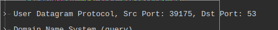

# Практика 6. Транспортный уровень I can write a text!!

## Wireshark: UDP (5 баллов)
Начните захват пакетов в приложении Wireshark и затем сделайте так, чтобы ваш хост отправил и
получил несколько UDP-пакетов (например, с помощью обращений DNS).
Выберите один из UDP-пакетов и разверните поля UDP в окне деталей заголовка пакета.
Ответьте на вопросы ниже, представив соответствующие скрины программы Wireshark.

#### Вопросы
1. Выберите один UDP-пакет. По этому пакету определите, сколько полей содержит UDP-заголовок.


   - 4 поля.
2. Определите длину (в байтах) для каждого поля UDP-заголовка, обращаясь к отображаемой
   информации о содержимом полей в данном пакете.


   - по 2 байта
3. Значение в поле Length (Длина) – это длина чего?
   - Общая длина: заголовок + данные 
4. Какое максимальное количество байт может быть включено в полезную нагрузку UDP-пакета?
   - Максимальное 2-х байтное число за вычетом длины заголовка: $(2^16 - 1) - 8 = 65527$
5. Чему равно максимально возможное значение номера порта отправителя?
   - Максимальное 2-х байтное число: $2^16 - 1 = 65535$
6. Какой номер протокола для протокола UDP? Дайте ответ и для шестнадцатеричной и
   десятеричной системы. Чтобы ответить на этот вопрос, вам необходимо заглянуть в поле
   Протокол в IP-дейтаграмме, содержащей UDP-сегмент.


   - В десятичной: 17, в Шестандцатиричной: 11
7. Проверьте UDP-пакет и ответный UDP-пакет, отправляемый вашим хостом. Определите
   отношение между номерами портов в двух пакетах.



   
- В первом пакете `Src port: 39175`, `Dst port: 53`. В ответном паркете эти поля поменялись местами 
(что весьма логично :)) 

## Программирование. FTP

### FileZilla сервер и клиент (3 балла)
1. Установите сервер и клиент [FileZilla](https://filezilla.ru/get)
2. Создайте FTP сервер. Например, по адресу 127.0.0.1 и портом 21. 
   Укажите директорию по умолчанию для работы с файлами.
3. Создайте пользователя TestUser. Для простоты и удобства можете отключить использование сертификатов.
4. Запустите FileZilla клиента (GUI) и попробуйте поработать с файлами (создать папки,
добавить/удалить файлы).

Приложите скриншоты.

#### Скрины


### FTP клиент (3 балла)
Создайте консольное приложение FTP клиента для работы с файлами по FTP. Приложение может
обращаться к FTP серверу, созданному в предыдущем задании, либо к какому-либо другому серверу 
(есть много публичных ftp-серверов для тестирования, [вот](https://dlptest.com/ftp-test/) один из них).

Приложение должно:
- Получать список всех директорий и файлов сервера и выводить его на консоль
- Загружать новый файл на сервер
- Загружать файл с сервера и сохранять его локально

Бонус: Не используйте готовые библиотеки для работы с FTP (например, ftplib для Python), а реализуйте решение на сокетах **(+3 балла)**.

#### Демонстрация работы
```
> python ftp_client_console.py --host 127.0.0.1 --user TestUser --passwd test --action list                                                                  1 ✘ 
Connected to 127.0.0.1
drwx------    2 1001     1001         4096 Mar 28 19:24 test_dir
-rw-------    1 1001     1001            0 Mar 28 19:25 test_file
Connection closed

> python ftp_client_console.py --host 127.0.0.1 --user TestUser --passwd test --action upload --filename lab06.md                                              ✔ 
Connected to 127.0.0.1
File lab06.md is uploaded
Connection closed

> python ftp_client_console.py --host 127.0.0.1 --user TestUser --passwd test --action list                                                                    ✔ 
Connected to 127.0.0.1
-rw-------    1 1001     1001         6695 Mar 28 19:42 lab06.md
drwx------    2 1001     1001         4096 Mar 28 19:24 test_dir
-rw-------    1 1001     1001            0 Mar 28 19:25 test_file
Connection closed

> python ftp_client_console.py --host 127.0.0.1 --user TestUser --passwd test --action download --filename test_file                                         2 ✘ 
Connected to 127.0.0.1
File test_file is downloaded
Connection closed
```

### GUI FTP клиент (4 балла)
Реализуйте приложение FTP клиента с графическим интерфейсом. НЕ используйте C#.


В приложении должна быть поддержана следующая функциональность:
- Выбор сервера с указанием порта, логин и пароль пользователя и возможность
подключиться к серверу. При подключении на экран выводится список всех доступных
файлов и директорий
- Поддержаны CRUD операции для работы с файлами. Имя файла можно задавать из
интерфейса. При создании нового файла или обновлении старого должно открываться
окно, в котором можно редактировать содержимое файла. При команде Retrieve
содержимое файла можно выводить в главном окне.

#### Демонстрация работы

Код можно найти [тут](ftp_client_gui.py)


