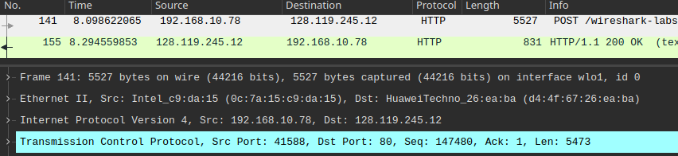
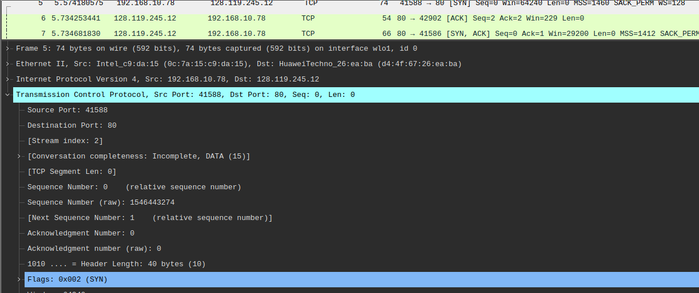
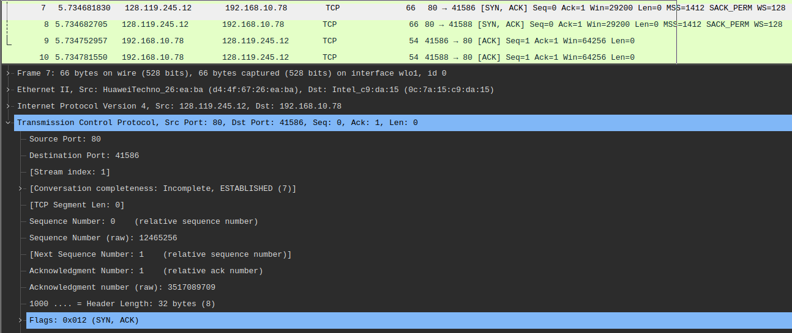
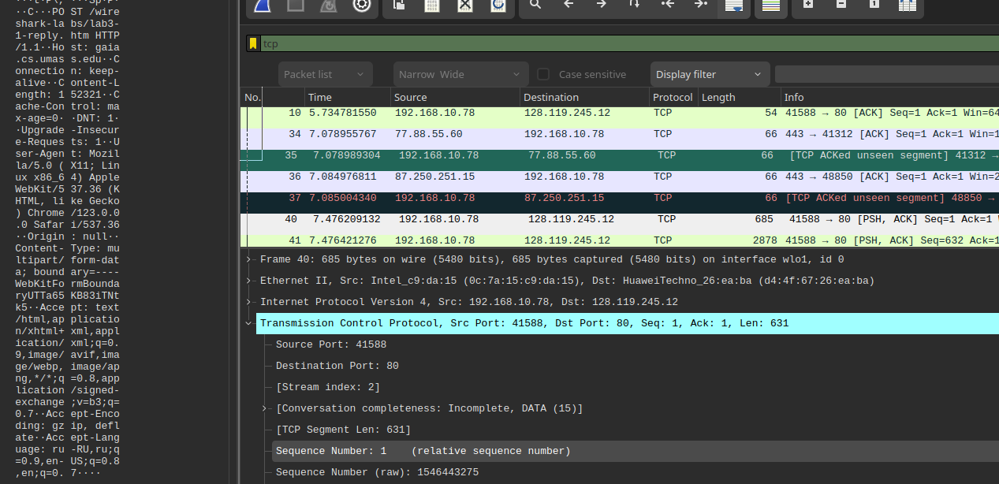
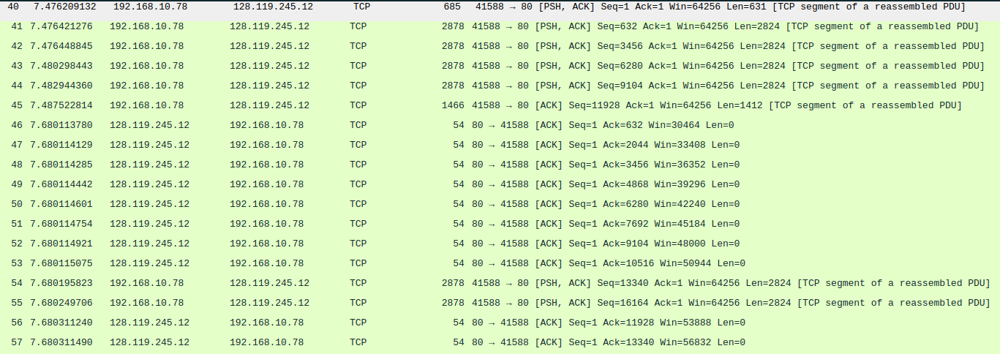
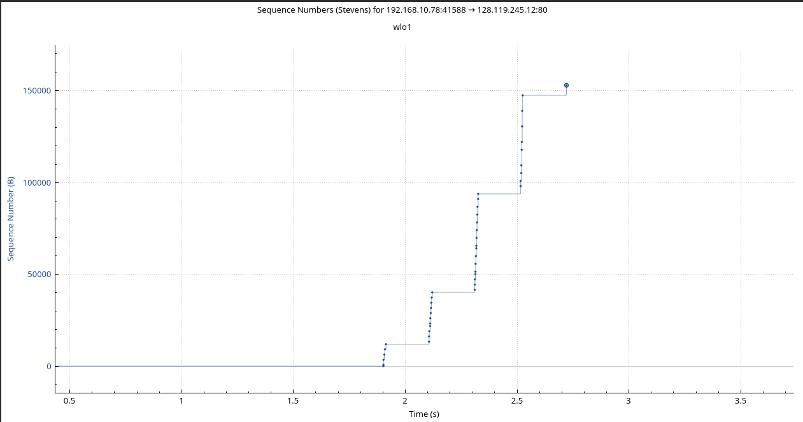

# Практика 7. Транспортный уровень

## Wireshark: TCP (5 баллов)

### Перехват TCP-передачи данных от вашего компьютера удаленному серверу

При ответе на вопросы прикладывайте соответствующие скрины программы Wireshark.

#### Подготовка

1. Откройте веб-браузер и перейдите по ссылке gaia.cs.umass.edu/wireshark-labs/alice.txt.
   Здесь вы найдете копию книги «Алиса в стране чудес» в формате ASCII. Сохраните этот файл
   на свой компьютер.
2. Перейдите по ссылке: gaia.cs.umass.edu/wireshark-labs/TCP-wireshark-file1.html. Сюда вы
   будете загружать ранее сохраненный файл.
3. Запустите Wireshark и начните перехват пакетов.
4. Теперь загрузите текстовый файл «Алиса в стране чудес» на указанной в п.2 страничке.
5. Остановите захват пакетов в приложении Wireshark. Используйте фильтр пакетов tcp.

#### Вопросы

1. Какой IP-адрес и номер порта TCP использует ваш компьютер (отправитель), передающий
   файл серверу gaia.cs.umass.edu? Для ответа на вопрос, возможно, проще выбрать http-сообщение
   и рассмотреть информацию TCP-пакета, используемого для передачи этого http-сообщения,
   в окне деталей заголовка пакета.
    - 192.168.10.72:41588
      
2. Каков IP-адрес у сервера gaia.cs.umass.edu? Каковы номера портов для отправки и приема
   TCP-сегментов этого соединения?
    - 128.119.245.12
    - Приём 80, отправка 80
3. Какой порядковый номер у SYN TCP-сегмента, который используется для установления
   TCP-соединения между компьютером клиента и сервером gaia.cs.umass.edu? Как
   определяется, что это именно SYN-сегмент?
    - 0
    - По соответствующему флагу
      
4. Какой порядковый номер у SYNACK-сегмента, отправленного сервером gaia.cs.umass.edu
   на компьютер клиента в ответ на SYN-сегмент? Какое значение хранится в поле
   подтверждения в SYNACK-сегменте? Как сервер gaia.cs.umass.edu определил это значение?
   Как определяется, что это именно SYNACK-сегмент?
    - 0
    - 1
    - увеличенный на единицу номер полученного сегмента
    - По соответствующим двум флагам
      
5. Какой порядковый номер у TCP-сегмента, содержащего команду POST протокола HTTP?
   (для нахождения команды POST вам потребуется проникнуть внутрь поля содержимого
   пакета в нижней части окна Wireshark, чтобы найти сегмент, в поле DATA которого
   хранится значение POST)
    - 1
      
6. Рассмотрите TCP-сегмент, содержащий команду POST протокола HTTP, как первый TCP-сегмент
   соединения. Какие порядковые номера у первых шести сегментов TCP-соединения
   (включая сегмент, содержащий команду POST протокола HTTP)? Когда был
   отправлен каждый сегмент? Когда был получен ACK-пакет для каждого сегмента?
   Покажите разницу между тем, когда каждый TCP-сегмент был отправлен и когда было
   получено каждое подтверждение, чему равно значение RTT для каждого из 6 сегментов?
    - 1, 632, 3456, 6280, 9104, 13340
    - 7.4762, 7.4764, 7.4764, 7.4802, 7.4829, 7.6801
    - 7.4875, 7.6801, 7.6801, 7.6801, 7.6801, 7.6803
    - 0.0113, 0.2037, 0.2037, 0.1999, 0.1972, 0.0002
    - RTT = 0.136 сек (усреднённая разность)
      
7. Чему равна пропускная способность (количество байтов, передаваемых в единицу
   времени) для этого TCP-соединения? Объясните, как вы получили это значение.
    - 101.39 Кб/сек
    - Поток данных разбился на блоки размера 2824 байта. Замерили время для 5 пакетов (первый усечённого размера не
      учитываем). Поэтому получаем ответ, как количество переданных байт на RTT = 2824 * 5 / 0.136

### Работа с Time-Sequence-Graph (Stevens) (2 балла)

Time-Sequence-Graph (Stevens) (Временная шкала (Стивенса)) – одна из графических утилит
Wireshark для протокола TCP. Для того, чтобы ее запустить, выберите TCP-сегмент в окне
захваченных полученных пакетов. Затем выберите команду меню Statistics => TCP Stream Graph =>
Time-Sequence-Graph (Stevens) (Статистика => График TCP потока => Временная шкала (Стивенса)).
Каждая точка представляет отправленный TCP-сегмент, на графике изображена зависимость
порядкового номера сегмента от времени, когда он был отправлен.

#### Подготовка (такая же, как в предыдущем задании)

1. Откройте веб-браузер и перейдите по ссылке gaia.cs.umass.edu/wireshark-labs/alice.txt.
   Здесь вы найдете копию книги «Алиса в стране чудес» в формате ASCII. Сохраните этот файл на
   свой компьютер.
2. Перейдите по ссылке: gaia.cs.umass.edu/wireshark-labs/TCP-wireshark-file1.html. Сюда вы
   будете загружать ранее сохраненный файл.
3. Запустите Wireshark и начните перехват пакетов
4. Теперь загрузите текстовый файл «Алиса в стране чудес» на указанной в п.2 страничке
5. Остановите захват пакетов в приложении Wireshark. Используйте фильтр пакетов tcp.

#### Задание

Используйте инструмент построения графиков Time-Sequence-Graph (Stevens), чтобы представить
изменение порядковых номеров на временной шкале для сегментов, отправленных от клиента
серверу gaia.cs.umass.edu. Приложите соответствующий скрин программы Wireshark.

#### Скрин



## Программирование. Эхо-запросы через UDP

Реализуйте сервер для пингования, а также его клиента.

### А. Серверная часть (2 балла)

Сервер находится в бесконечном цикле, ожидая приходящие UDP-пакеты.
Если пакет прибывает, то сервер просто изменяет символы входящего сообщения на заглавные и
отправляет их обратно клиенту. Серверный код должен моделировать 20% потерю пакетов.

### Б. Клиентская часть (2 балла)

Клиент должен отправить 10 эхо-запросов серверу. Поскольку UDP является ненадежным с точки
зрения доставки протоколом, то пакет, отправленный от клиента к серверу или наоборот, может
быть потерян в сети. Так как клиент не может бесконечно ждать ответа на запрос, нужно задать
период ожидания ответа (тайм-аут), равный одной секунде – если ответ не будет получен в
течение одной секунды, клиентская программа должна предполагать, что пакет потерян.

Ваша клиентская программа должна:

- отправить эхо-запрос, используя UDP
- распечатать ответное сообщение от сервера (если такое есть)
- вычислить и вывести на печать время оборота (RTT) в секундах для каждого пакета при
  ответе сервера
- в противном случае, вывести сообщение «Request timed out»

Формат сообщения:
`Ping номер_последовательности время`

- номер_последовательности начинается с 1 и увеличивается до 10 для каждого
  последующего сообщения, отправленного клиентом
- время – это момент времени, когда клиент отправляет сообщение

Сделайте скриншоты, подтверждающие корректную работу вашей программы пингования со стороны клиента.

#### Демонстрация работы

<u>Вывод сервера:</u>

```
Server is listening on localhost:12345
Packet lost
```

<u>Вывод клиента:</u>

``` 
Received: PING 1 2024-04-04 23:47:28.368552 RTT: 0.00085 seconds
Received: PING 2 2024-04-04 23:47:28.369424 RTT: 0.00018 seconds
Received: PING 3 2024-04-04 23:47:28.369618 RTT: 0.00018 seconds
Received: PING 4 2024-04-04 23:47:28.369811 RTT: 0.00018 seconds
Received: PING 5 2024-04-04 23:47:28.370010 RTT: 0.00015 seconds
Request timed out
Received: PING 7 2024-04-04 23:47:29.371117 RTT: 0.00078 seconds
Received: PING 8 2024-04-04 23:47:29.371946 RTT: 0.00067 seconds
Received: PING 9 2024-04-04 23:47:29.372663 RTT: 0.00064 seconds
Received: PING 10 2024-04-04 23:47:29.373347 RTT: 0.00064 seconds
```

* Код сервера: [echo_udp_server.py](echo_udp_server.py)
* Код клиента: [echo_udp_client.py](echo_upd_client.py)

### В. Вывод в формате ping (2 балла)

Версия клиента из предыдущей части (Б) вычисляет время оборота для каждого пакета и выводит
его отдельно. Измените вывод таким образом, чтобы он соответствовал тому, как это делается в
стандартной утилите ping.

Для этого вам нужно будет сообщить минимальное, максимальное и среднее значение RTT в
конце каждого ответа от сервера. Дополнительно вычислите коэффициент потери пакетов (в
процентах).

#### Демонстрация работы

Изменил вывод клиента, теперь выводится больше информации: 

```  
Received: PING 1 2024-04-05 00:07:33.523136 RTT: 0.00077 seconds

1 packets transmitted, 1 packets received, 0.000% packet loss
rtt min/avg/max = 0.775/0.775/0.775 ms

Request timed out

Received: PING 3 2024-04-05 00:07:34.524330 RTT: 0.00077 seconds

3 packets transmitted, 2 packets received, 33.333% packet loss
rtt min/avg/max = 0.774/0.774/0.775 ms

Received: PING 4 2024-04-05 00:07:34.525203 RTT: 0.00066 seconds

4 packets transmitted, 3 packets received, 25.000% packet loss
rtt min/avg/max = 0.660/0.736/0.775 ms

Received: PING 5 2024-04-05 00:07:34.525957 RTT: 0.00064 seconds

5 packets transmitted, 4 packets received, 20.000% packet loss
rtt min/avg/max = 0.644/0.713/0.775 ms

Received: PING 6 2024-04-05 00:07:34.526705 RTT: 0.00067 seconds

6 packets transmitted, 5 packets received, 16.667% packet loss
rtt min/avg/max = 0.644/0.704/0.775 ms

Received: PING 7 2024-04-05 00:07:34.527465 RTT: 0.00068 seconds

7 packets transmitted, 6 packets received, 14.286% packet loss
rtt min/avg/max = 0.644/0.700/0.775 ms

Received: PING 8 2024-04-05 00:07:34.528245 RTT: 0.00060 seconds

8 packets transmitted, 7 packets received, 12.500% packet loss
rtt min/avg/max = 0.601/0.686/0.775 ms

Received: PING 9 2024-04-05 00:07:34.528926 RTT: 0.00052 seconds

9 packets transmitted, 8 packets received, 11.111% packet loss
rtt min/avg/max = 0.515/0.664/0.775 ms

Received: PING 10 2024-04-05 00:07:34.529521 RTT: 0.00052 seconds

10 packets transmitted, 9 packets received, 10.000% packet loss
rtt min/avg/max = 0.515/0.649/0.775 ms
```

### Г. UDP Heartbeat (4 балла)

UDP Heartbeat (монитор доступности) подобен программе пингования. Он может быть
использован для проверки, работает ли приложение, и вывода сообщения об односторонней
потере пакетов.

Клиент отправляет порядковый номер и текущую временную метку в пакете UDP на сервер,
который слушает «сердцебиение» (т.е. ожидает UDP-пакеты) клиента. После получения пакетов
сервер вычисляет разницу во времени и сообщает о потерях. Если пакеты отсутствуют
определенный период времени, заданный параметром, то делается предположение, что
клиентское приложение остановлено и соответствующее сообщение выводится на консоль
сервера.

Реализуйте UDP Heartbeat (обе части – клиент и сервер), доработав обе ваши части программы
пингования из заданий А и Б.

Обратите внимание, что клиентов у сервера может быть сразу несколько одновременно.
Протестируйте такой сценарий.

#### Демонстрация работы

* Код сервера: [heartbeat_server.py](heartbeat_server.py)
* Код клиента: [heartbeat_client.py](heartbeat_client.py)

Сервер: 

``` 
Server is listening on localhost:12345
Ok from ('127.0.0.1', 41043), packet 1, delay 0.001 seconds
Ok from ('127.0.0.1', 41043), packet 2, delay 0.001 seconds
Ok from ('127.0.0.1', 41043), packet 3, delay 0.001 seconds
Ok from ('127.0.0.1', 41043), packet 4, delay 0.001 seconds
Ok from ('127.0.0.1', 41043), packet 5, delay 0.001 seconds
Packet loss detected from ('127.0.0.1', 41043). Missing packets from 6 to 7, packet 8, delay 0.001 seconds
Ok from ('127.0.0.1', 41043), packet 9, delay 0.001 seconds
Packet loss detected from ('127.0.0.1', 41043). Missing packets from 10 to 10, packet 11, delay 0.001 seconds
Client ('127.0.0.1', 41043) is assumed stopped. No heartbeat received for 10 seconds.

```

Клиент: 

``` 
Heartbeat 1 sent
Heartbeat 2 sent
Heartbeat 3 sent
Heartbeat 4 sent
Heartbeat 5 sent
Emulated miss
Emulated miss
Heartbeat 8 sent
Heartbeat 9 sent
Emulated miss
Heartbeat 11 sent
Emulated miss
```

Сервер (получает запросы от 3-х клиентов):

``` 
Server is listening on localhost:12345
Ok from ('127.0.0.1', 46515), packet 1, delay 0.001 seconds
Ok from ('127.0.0.1', 46015), packet 1, delay 0.001 seconds
Ok from ('127.0.0.1', 48281), packet 1, delay 0.001 seconds
Ok from ('127.0.0.1', 46515), packet 2, delay 0.001 seconds
Packet loss detected from ('127.0.0.1', 46015). Missing packets from 2 to 3, packet 4, delay 0.001 seconds
Packet loss detected from ('127.0.0.1', 46515). Missing packets from 3 to 3, packet 4, delay 0.002 seconds
Packet loss detected from ('127.0.0.1', 48281). Missing packets from 2 to 3, packet 4, delay 0.002 seconds
Ok from ('127.0.0.1', 46015), packet 5, delay 0.001 seconds
Ok from ('127.0.0.1', 48281), packet 5, delay 0.002 seconds
Packet loss detected from ('127.0.0.1', 46515). Missing packets from 5 to 5, packet 6, delay 0.001 seconds
Ok from ('127.0.0.1', 46015), packet 6, delay 0.001 seconds
Ok from ('127.0.0.1', 48281), packet 6, delay 0.002 seconds
Ok from ('127.0.0.1', 46515), packet 7, delay 0.001 seconds
Ok from ('127.0.0.1', 48281), packet 7, delay 0.001 seconds
Packet loss detected from ('127.0.0.1', 46015). Missing packets from 7 to 7, packet 8, delay 0.001 seconds
Ok from ('127.0.0.1', 46515), packet 8, delay 0.002 seconds
Ok from ('127.0.0.1', 46515), packet 9, delay 0.001 seconds
Ok from ('127.0.0.1', 46015), packet 9, delay 0.002 seconds
Packet loss detected from ('127.0.0.1', 48281). Missing packets from 8 to 8, packet 9, delay 0.002 seconds
Ok from ('127.0.0.1', 46015), packet 10, delay 0.001 seconds
Ok from ('127.0.0.1', 48281), packet 10, delay 0.002 seconds
Ok from ('127.0.0.1', 46515), packet 10, delay 0.002 seconds
Client ('127.0.0.1', 46515) is assumed stopped. No heartbeat received for 10 seconds.
Client ('127.0.0.1', 46015) is assumed stopped. No heartbeat received for 10 seconds.
Client ('127.0.0.1', 48281) is assumed stopped. No heartbeat received for 10 seconds.
```

## Задачи

### Задача 1 (3 балла)

Рассмотрим протоколы GBN и SR. Предположим, пространство порядковых номеров имеет размер $k$.

Постановка задачи: найти наибольшее допустимое окно передачи, которое позволит обойти
возникновение проблемы, показанной на рисунке для каждого из этих протоколов?


Описание проблемы:
Отсутствие синхронизации между окнами отправителя и получателя имеет важные последствия,
когда мы сталкиваемся с ограниченностью диапазона порядковых номеров. Рассмотрим, что
могло бы произойти, например, если у нас есть четыре пакета с порядковыми номерами 0, 1, 2, 3,
а размер окна равен трем. Предположим, пакеты с 0 по 2 переданы отправителем, корректно
получены и подтверждены получателем. В этот момент окно получателя заполняется четвертым,
пятым и шестым пакетами, которые имеют порядковые номера 3, 0 и 1, соответственно. Теперь
рассмотрим два сценария.

В первом сценарии (на рисунке сверху) квитанции ACK на первые три пакета доставлены верно.
Таким образом, отправитель сдвигает окно вперед и отправляет четвертый, пятый и шестой
пакеты с порядковыми номерами 3, 0 и 1 соответственно.
Пакет с порядковым номером 3 потерян, но пакет с порядковым номером 0, **содержащий новые данные**,
получен.

Во втором случае (рисунок снизу) ACK пакеты для первых трех пакетов данных потеряны, и
отправитель пересылает эти пакеты. Таким образом, получатель далее получает пакет с
порядковым номером 0 — **копию первого отправленного**.
Теперь рассмотрим ту же ситуацию с точки зрения принимающей стороны. Действия,
выполняемые передающей стороной, скрыты от нее; принимающая сторона способна лишь
следить за последовательностями получаемых пакетов и генерируемых квитанций. Подобная
ограниченность приводит к тому, что обе описанные выше ситуации воспринимаются
принимающей стороной как одинаковые. Она не может отличить исходную передачу пакета от
повторной.

#### Решение

todo

### Задача 2 (2 балла)

Представим себе следующую ситуацию: один хост расположен в Санкт-Петербурге, а другой — во
Владивостоке. Пусть время оборота RTT между этими двумя хостами приблизительно равно $30$ мс.
Предположим далее, что хосты соединены каналом со скоростью передачи $R$, равной $1$ Гбит/с
($10^9$ бит/с).

Предположим, что размер передаваемого пакета составляет $1500$ байт, включая поля
заголовка и данные.

Насколько большим должен быть размер окна $n$, чтобы использование канала составило
более $98$ процентов?

#### Решение

Воспользуемся формулой:
$\dfrac{n \cdot \frac{L}{R}}{RTT + \frac{L}{R}} \ge 0.98 \Leftrightarrow
\dfrac{n \cdot \frac{1500 \cdot 8}{10^9}}{0.03 + \frac{1500 \cdot 8}{10^9}} \ge 0.98 \implies
n \ge 2451$


